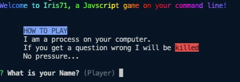

# Iris71

## What is Iris71?
It's a simple command line game made using Node.js. It is just currently a short javascript quiz.

## How to run

I have deployed this project to the npm registry as an execuetable.
In order to run it, just install node and then open your terminal and run
`npx iris71`

## Rules

The rules here are simple, the program will run until you get a question wrong or you finsh the quiz in that case you will be shown some congratulatory ASCII art as shown below

## Skills Acquired

-> Learnt about asynchronous functions, awaits and promises

-> Learnt how to build muy own command line tool using Node,js and certain libraries such as inquirer

-> Learnt how to deploy my project to npm (in this case I have deployed my project as an execuetable)

## Possible future developments

Look to expand the scope of questions asked as to allow different topics and for the end user to have more control over what type of questions are asked, i.e, being able to choose the topic they want,etc.

